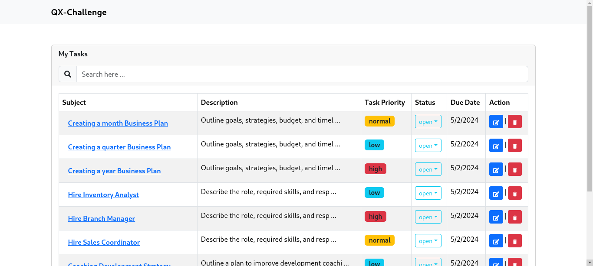

# Quatrix Software Challenge

## Technologies Used
1. React (client-side rendered React for web apps)
2. Typescript - React + Typescript + Vite
3. Redux Toolkit - State Management

## How to Run the Project
1. **Clone the Repository:** 

        git clone <repository-url>

2. **Navigate to the Repository:** 

        cd <repository-name>

3. **Install Dependencies:** 

        npm install

4. **Run the Project:** 

        npm run dev

5. **Access the Application:** Once the project is running, you can access it in your web browser. The application may be running on localhost:5173

## Page Layout

## Reasons for choosing React
1. **Component-Based Architecture:** React's component-based architecture allows developers to build encapsulated, reusable UI components. This makes it easier to manage complex UIs and promotes code reusability.

2. **Declarative Syntax:** React uses a declarative syntax, which makes it easier to understand and reason about the UI code. Developers can focus on describing "what" the UI should look like, rather than the steps to achieve it.

3. **Virtual DOM:** React uses a virtual DOM, which is an in-memory representation of the actual DOM. This allows React to minimize DOM manipulation, leading to better performance.

4. **One-Way Data Binding:** React uses one-way data binding, which means that data flows only in one direction: from parent to child components. This makes it easier to maintain the state of the application.

5. **Ecosystem and Community:** React has a large ecosystem of libraries, tools, and community support. This makes it easier for developers to find solutions to common problems and stay up-to-date with best practices.

## Reasons for choosing Redux Toolkit for state management
1. **Simplified Redux Setup:** Redux Toolkit simplifies the setup and configuration of Redux by providing a set of tools and best practices. This reduces boilerplate code and makes it easier to get started with Redux.

2. **Immutability and Immutability Helpers:** Redux Toolkit encourages the use of immutability for state updates, which helps prevent bugs and makes the application more predictable. It also provides built-in immutability helpers, such as immer, to make working with immutable state easier.

3. **Built-in Thunk Middleware:** Redux Toolkit includes built-in thunk middleware, which allows for writing asynchronous logic in Redux actions. This makes it easier to handle side effects, such as API calls, in Redux.

4. **DevTools Integration:** Redux Toolkit integrates with the Redux DevTools extension, which provides powerful debugging tools for inspecting the state and actions of a Redux application.

5. **Officially Recommended:** Redux Toolkit is the officially recommended way to use Redux by the Redux team. It embodies best practices and patterns for using Redux in modern React applications.

## Reasons for choosing Typescript
1. **Static Typing:** TypeScript is statically typed, which means that types are checked at compile time. This helps catch errors early in the development process and makes the code more robust.

2. **Better Code Readability and Maintainability:** TypeScript's type annotations make the code more readable and easier to understand. It also helps in documenting the code and makes it easier for other developers to work with it.

3. **Improved Code Quality:** TypeScript helps improve code quality by catching common errors, such as typos and type mismatches, before runtime. This leads to fewer bugs and a more reliable application.

4. **Enhanced Tooling Support:** TypeScript has excellent tooling support, including code editors, linters, and IDEs. This improves developer productivity and makes it easier to navigate and understand the codebase.

5. **Compatibility with JavaScript:** TypeScript is a superset of JavaScript, which means that existing JavaScript code can be gradually migrated to TypeScript. This allows developers to take advantage of TypeScript's features without having to rewrite the entire codebase. 

## Progress so far
1. ~~Project Setup: Set up the project with React + Typescript + Vite.~~

2. ~~Navigation Bar Component: Create a Navigation Bar component for easy navigation within the application.~~
3. ~~Table Component: Develop a Table component to display task data in a tabular format.~~

4. ~~Bootstrap Styling: Style the components using Bootstrap for a visually appealing interface.~~

5. ~~Task State Management: Create a feature slice to manage tasks state, ensuring data consistency across the application.~~

6. ~~Task List Display: List all tasks on the table for easy viewing and management.~~

7. ~~Task Details Modal: Implement a modal to view detailed information about a task.~~

8. ~~Global Search Component: Create a global search component to search for tasks based on keywords.~~

9. Implement a clear pagination control component

10. Visually distinguish task statuses (e.g., color-coding).

11. New Task Form: Implement a form for creating new tasks, ensuring a smooth user experience.

12. Create Task API Integration: Send a POST request to the Task API to create a new task.

13. Edit Task Functionality: Allow editing of existing tasks by sending a PATCH request to update the changes.

14. Confirmation Step for Deletion: Implement a confirmation step before deleting a task to prevent accidental deletions.

15. Delete Task API Integration: Send a DELETE request to the Task API to delete a task.

16. Task Status Buttons: Implement buttons for actions based on the current task status, following the provided transition table and diagram.

17. Dynamic Task Status Update: Update the task's displayed status dynamically based on user actions.

18. Testing: Perform thorough testing of the application to ensure functionality and reliability.

19. Dockerize the application.

20. React Native Build: Build the same application using React Native for mobile compatibility.